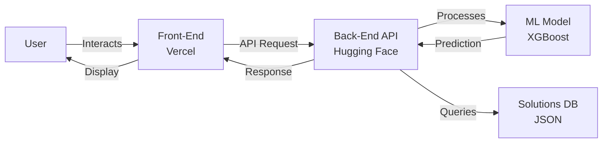

<p align="center">
    <a href="https://chatbot-psi-dusky.vercel.app/" target="_blank">
        
    </a>
</p>
<div align="center">

### MoodMate - AI Mental Health Chatbot


[](https://chatbot-psi-liart.vercel.com/adham-mahmouds-projects/chatbot)


</div>

-----------------
## 2. 🎯 Project Overview & Goal

The primary objective of this project was to develop a **highly accurate and reliable Machine Learning model** to predict the likelihood of an individual seeking professional mental health treatment. This model serves as the core intelligence for a conversational Chatbot designed to provide personalized recommendations and guidance based on a user's self-reported profile and concerns.

### Core Success Criteria ✨

The project was guided by two essential success criteria:

1.  **High Predictive Performance:** Achieve a classification model with strong discriminatory power (high ROC-AUC and F1-Score).
2.  **Model Interpretability:** Ensure the final model allows for clear insight into the most influential factors, enabling the chatbot to offer explainable and trustworthy recommendations.

---

## 3. 🧠 Final Model Selection & Performance

The final production model selected is the **XGBoost Classifier**, thoroughly optimized using the **Optuna** hyperparameter tuning framework on a dataset enhanced with Target Encoding. The model was chosen for its excellent balance of stability, high performance, and interpretability.

### Performance Metrics (Validation Set)

The model demonstrated exceptional performance on the validation set:

<div align="center">
    <table style="width:70%; border-collapse: collapse; margin-top: 15px;">
        <caption style="font-weight: bold; padding-bottom: 5px;">Optimized XGBoost Classifier Metrics</caption>
        <tr>
            <th style="border: 1px solid #ddd; padding: 8px; background-color: #f2f2f2; text-align: center;">Metric</th>
            <th style="border: 1px solid #ddd; padding: 8px; background-color: #f2f2f2; text-align: center;">Score</th>
            <th style="border: 1px solid #ddd; padding: 8px; background-color: #f2f2f2; text-align: left;">Interpretation</th>
        </tr>
        <tr>
            <td style="border: 1px solid #ddd; padding: 8px; text-align: center;"><b>ROC AUC</b></td>
            <td style="border: 1px solid #ddd; padding: 8px; text-align: center;"><b>0.9858</b></td>
            <td style="border: 1px solid #ddd; padding: 8px;">Outstanding ability to distinguish between the two classes.</td>
        </tr>
        <tr>
            <td style="border: 1px solid #ddd; padding: 8px; text-align: center;"><b>Accuracy</b></td>
            <td style="border: 1px solid #ddd; padding: 8px; text-align: center;"><b>0.9200</b></td>
            <td style="border: 1px solid #ddd; padding: 8px;">Correctly classifies individuals 92% of the time.</td>
        </tr>
        <tr>
            <td style="border: 1px solid #ddd; padding: 8px; text-align: center;"><b>F1 Score</b></td>
            <td style="border: 1px solid #ddd; padding: 8px; text-align: center;"><b>0.9202</b></td>
            <td style="border: 1px solid #ddd; padding: 8px;">Excellent balance between precision and recall.</td>
        </tr>
    </table>
</div>
<br>

### Top Feature Importance (Actionable Insights) 💡

The feature importance analysis ensures the model focuses on **domain-relevant and stable features** for generating reliable chatbot recommendations:

1.  **`family_history`**
2.  **`Family_Support_Impact`**
3.  **`Is_MidYear`**
4.  **`care_options`**
5.  **`Is_Winter`**

---

## 4. ⚙️ Data Pipeline & Feature Engineering

The project utilized the Mental Health Dataset after meticulous screening of alternatives. A rigorous data pipeline was executed to prepare the raw data for high-performance machine learning.

### 🧹 Data Cleaning Summary

* **Initial Dimensions:** 292,364 entries and 17 columns.
* **Deduplication:** **2,313** duplicate rows were removed, resulting in **290,051** unique records.
* **Missing Values:** **5,193** missing values were imputed in the `self_employed` column.

### 🧪 Feature Engineering & Encoding Strategy

A multi-step feature engineering process was essential for achieving high model performance:

| Technique | Feature(s) Affected | Rationale |
| :--- | :--- | :--- |
| **Temporal Feature Extraction** | `Timestamp` -> `Year`, `Month`, `Day`, `Hour` | Capturing potential seasonal or time-of-day behavioral patterns. |
| **High-Cardinality Encoding** | **Target Encoding** (w/ 5-fold CV) | `Country` | Effectively summarized the target likelihood (treatment rate) for each country while rigorously preventing data leakage. |
| **Composite Feature Creation** | Combination of several categorical features | `Stress_Score`, `Family_Support_Impact` | Creating complex, highly predictive features based on domain knowledge and variable interactions. |
| **Categorical Encoding** | Ordinal, Binary, One-Hot | `Days_Indoors`, `Gender`, `Occupation` | Standard preparation for various model types. |

---
## 5. 📈 MLOps & Experiment Management (MLflow)

This section details the use of **MLflow** for tracking, managing, and comparing the Machine Learning experiments conducted during the development phase. This process ensured robust model selection, reproducibility, and organized logging of metrics and artifacts.

### Experiment Summary 🧪

* **Project Name:** "Milestone 5 mlflow deployment".
* **Total Runs:** 6 experimental runs were conducted, comparing various algorithms including XGBoost, CatBoost, Stacking, and MLP.

### Model Comparison & Insights

MLflow provided clear tracking of duration and performance, leading to critical deployment insights:

<div align="center">
    <table style="width:80%; border-collapse: collapse; margin-top: 15px;">
        <caption style="font-weight: bold; padding-bottom: 5px;">Training Duration Comparison (MLflow Logged)</caption>
        <tr>
            <th style="border: 1px solid #ddd; padding: 8px; background-color: #f2f2f2; text-align: left;">Model Run</th>
            <th style="border: 1px solid #ddd; padding: 8px; background-color: #f2f2f2; text-align: center;">Duration</th>
            <th style="border: 1px solid #ddd; padding: 8px; background-color: #f2f2f2; text-align: left;">Key Insight</th>
        </tr>
        <tr>
            <td style="border: 1px solid #ddd; padding: 8px;"><b>Stacked Model Run</b></td>
            <td style="border: 1px solid #ddd; padding: 8px; text-align: center;">16.7 min</td>
            <td style="border: 1px solid #ddd; padding: 8px;">Significantly the slowest run due to multiple base estimators.</td>
        </tr>
        <tr>
            <td style="border: 1px solid #ddd; padding: 8px;">CatBoost (Raw Data)</td>
            <td style="border: 1px solid #ddd; padding: 8px; text-align: center;">4.5 min</td>
            <td style="border: 1px solid #ddd; padding: 8px;">Slower training time before specialized preprocessing.</td>
        </tr>
        <tr>
            <td style="border: 1px solid #ddd; padding: 8px;">CatBoost (Target Encoding)</td>
            <td style="border: 1px solid #ddd; padding: 8px; text-align: center;">48.7 s</td>
            <td style="border: 1px solid #ddd; padding: 8px;">Target Encoding significantly reduced training time by over 80%.</td>
        </tr>
        <tr>
            <td style="border: 1px solid #ddd; padding: 8px;">Final XGBoost Model (Baseline)</td>
            <td style="border: 1px solid #ddd; padding: 8px; text-align: center;">17.5 s</td>
            <td style="border: 1px solid #ddd; padding: 8px;">The fastest baseline model logged.</td>
        </tr>
    </table>
</div>
<br>

### Model Registration 🏷️

The **Final\_XGBoost\_Optuna\_Run** was successfully logged (Duration: 23.8s), and its corresponding model file (`xgb_optuna_model`) is registered in MLflow. This ensures the best performing model can be seamlessly loaded and served for inference within the Streamlit/Chatbot application.

---
# 💬 MoodMate - AI Mental Health Chatbot


---


## 🌟 Overview

**MoodMate** is an AI-powered mental health chatbot that conducts empathetic conversations, analyzes user responses using machine learning, and provides personalized mental health advice with curated resources (videos & podcasts).

### 🎯 Key Capabilities

- ✅ Conducts structured mental health interviews
- ✅ Sentiment analysis and empathetic responses
- ✅ ML-based risk prediction (XGBoost model)
- ✅ Personalized solutions with multimedia resources
- ✅ Multi-language support (Arabic/English)
- ✅ Persistent conversation storage

---

## ✨ Features

| Feature | Description |
|---------|-------------|
| 🤖 **Intelligent Conversation** | Natural, empathetic dialogue using sentiment analysis |
| 🧠 **ML Prediction** | XGBoost model predicts mental health stability score |
| 💾 **Data Persistence** | Saves interviews to SQLite database |
| 🎨 **Modern UI** | Clean, responsive web interface |
| 📊 **Custom Solutions** | Tailored advice based on user responses |
| 🎥 **Resource Library** | Curated videos and podcasts for support |

---

## 🔄 Project Evolution

### Version 1: Python Console Bot 🐍
**Foundation chatbot with core logic**
- Terminal-based conversation
- Response/rule engine (JSON)
- SQLite database integration
- TextBlob sentiment analysis

### Version 2: Streamlit Web App ✨
**Enhanced UI with integrated ML**
- Web-based interface
- Real-time prediction
- Interactive solutions menu
- Session state management

### Version 3: Full-Stack Deployment 🚀
**Production-ready architecture**

<table>
<tr>
<td width="50%">

**🎨 Front-End**
- Platform: **Vercel**
- Tech: HTML, CSS, JavaScript
- Features: Dynamic UI, API integration

</td>
<td width="50%">

**⚙️ Back-End**
- Platform: **Hugging Face Spaces**
- Tech: FastAPI, Python
- Features: ML pipeline, REST API

</td>
</tr>
</table>

---

## 🏗️ Architecture



### 📦 Core Components

#### 1. **Response Engine**
- JSON-based question/answer system
- Keyword matching algorithm
- Dynamic conversation flow

#### 2. **ML Pipeline** (8-Step Process)
```
User Input → Standardization → Feature Engineering → 
Encoding → Scaling → Model Prediction → Score Calculation → 
Solutions Mapping → Final Report
```

#### 3. **Solutions System**
- Problem identification
- Symptom descriptions
- Actionable advice
- Multimedia resources (videos/podcasts)

---

## 💻 Technologies Used

<div align="center">

| Category | Technologies |
|----------|--------------|
| **Back-End** |   |
| **Front-End** |    |
| **ML/AI** |   |
| **Database** |  |
| **Deployment** |   |

</div>

---

## 🚀 Deployment

### Back-End (Hugging Face Spaces)

#### Required Files
```
📁 backend/
├── app.py                    # Main FastAPI application
├── health_chatbot_model.joblib  # Trained ML model
├── requirements.txt          # Python dependencies
├── Dockerfile               # Container configuration
├── space-start.sh           # Startup script
└── .gitattributes           # Git LFS configuration
```

#### Key Configuration
```python
# app.py - API Endpoint
@app.post("/predict_health")
async def predict_health(data: UserData):
    # ML prediction pipeline
    # Returns: stability_score, solutions_report
```

**🔗 Live Back-End:** [Hugging Face Space](https://huggingface.co/spaces/Adhamelmalhy/Chatbot)

#### Deploy Command
```bash
git push hf main
```

---

### Front-End (Vercel)

#### Configuration
```javascript
// Update API URL in app.js
const API_URL = 'https://adhamelmalhy-chatbot.hf.space/predict_health';
```

**🔗 Live Front-End:** [Vercel Deployment](https://chatbot-psi-liart.vercel.com/adham-mahmouds-projects/chatbot)

#### Deploy Steps
1. Push code to GitHub
2. Import project in Vercel
3. Configure build settings
4. Deploy automatically

---

## 📊 Data Flow

### Required Input Fields (in order)
```javascript
[
  "Gender",
  "self_employed",
  "family_history",
  "Days_Indoors",
  "Growing_Stress",
  "Changes_Habits",
  "Mental_Health_History",
  "Mood_Swings",
  "Coping_Struggles",
  "Work_Interest",
  "Social_Weakness",
  "mental_health_interview",
  "care_options",
  "Occupation",
  "Country"
]
```

### API Response Format
```json
{
  "stability_score": 75.8,
  "solutions": [
    {
      "problem": "Stress Management",
      "description": "...",
      "solution": "...",
      "video": "https://...",
      "podcast": "https://..."
    }
  ]
}
```

---

## 🔮 Future Improvements

<div align="center">

| Feature | Description | Priority |
|---------|-------------|----------|
| 🗄️ **PostgreSQL Integration** | Persistent cloud database for scalability | 🔴 High |
| 🌍 **Full English Support** | Expand to international audience | 🟡 Medium |
| 📱 **Mobile App** | Native iOS/Android applications | 🟢 Low |
| 🔄 **Multi-Model System** | Support multiple use cases (education + consultation) | 🔴 High |
| 📈 **Analytics Dashboard** | Admin panel for monitoring conversations | 🟡 Medium |
| 🔐 **User Authentication** | Secure personal accounts | 🟡 Medium |

</div>

---

## 📚 Documentation Structure

```
📖 Full Documentation
├── 🤖 Chatbot 1: Python Console (Core Logic)
├── ✨ Chatbot 2: Streamlit Web App (ML Integration)
├── 🚀 Chatbot 3: Full-Stack Deployment
│   ├── Front-End (Vercel)
│   └── Back-End (Hugging Face Spaces)
├── 🧠 ML Pipeline (8-Step Process)
├── 💾 Database Schema
└── 🎨 UI/UX Design Patterns
```


## . 💡 Future Enhancements

This list outlines suggested enhancements that can be implemented in future development stages to further evolve the MoodMate Chatbot project:

* **Persistent Database (PostgreSQL):** Integrate a PostgreSQL database for permanently storing conversation logs, user answers, and predictions for long-term analysis and auditing.
* **Multilingual Support:** Add support for other languages (such as English) to make the chatbot available to a wider segment of users.
* **Multi-Model State Challenge:** Integrate an additional machine learning model with another dataset. The goal is to evolve the chatbot to operate in **two different states** (e.g., one state for psychological consultation and one for general information/education), instead of relying on a single state.
* **Enhanced Frontend Features:** Incorporate new and enhanced interactive features in the Front-End to improve the overall user experience.

---
## . 🎉 Conclusion and Licensing

The MoodMate project successfully achieved a complex multi-platform deployment, coupling a highly optimized **XGBoost prediction service** with a robust **State Machine conversational logic**. This architecture ensures both high predictive accuracy and a smooth, guided user experience.

### Live Project Link 🔗

You can access and test the final deployed Front-End here:

**[https://adham-portfolio.vercel.app/](https://chatbot-psi-dusky.vercel.app/)**

*(Note: This link relies on the Back-End API deployed on Hugging Face Spaces being active.)*


<div align="center">

**⭐ If you find this project helpful, please consider giving it a star!**

Made with ❤️ and 🧠

</div>


